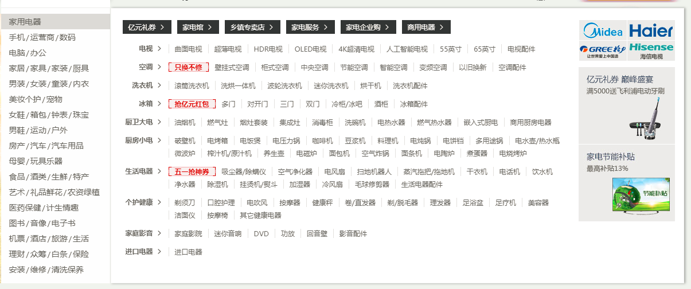

## Welcome to GitHub Pages

## 页面练习

1. [测试用页面](https://shanyuhai123.github.io/pagesPractice/test/hello.html)

 ## 分类

### IFE-CSS
1. [No.1 - 制作一个简单的菜单动画效果](http://ife.baidu.com/course/detail/id/18)

   [实现效果(codepen)](https://codepen.io/hackyuan/pen/ERjrXp)

   [上面打不开用这个(github-pages)](https://shanyuhai123.github.io/pagesPractice/IFE/CSS/01/index.html)

2. [No.2 - 初步接触 CSS 2D 变形](http://ife.baidu.com/course/detail/id/29)

   [实现效果(codepen)](https://codepen.io/hackyuan/pen/PaPdNe)

   [打不开换这个(github-pages)](https://shanyuhai123.github.io/pagesPractice/IFE/CSS/02/index.html)

3. [No.3 - CSS transition 和 CSS transform 配合制作动画](http://ife.baidu.com/course/detail/id/30)

   [实现效果(github-pages)](https://shanyuhai123.github.io/pagesPractice/IFE/CSS/03/index.html)

4. ​

### 菜单栏

1. [模拟京东菜单栏](https://shanyuhai123.github.io/pagesPractice/MenuBar/jingdong.html)

   

   未完成,有一些知识需要了解后才能完成

### 布局

1. [居中布局](https://shanyuhai123.github.io/pagesPractice/Others/center.html)

## 其他的练习

1. [简陋手风琴](https://shanyuhai123.github.io/pagesPractice/Others/accordion.html)

